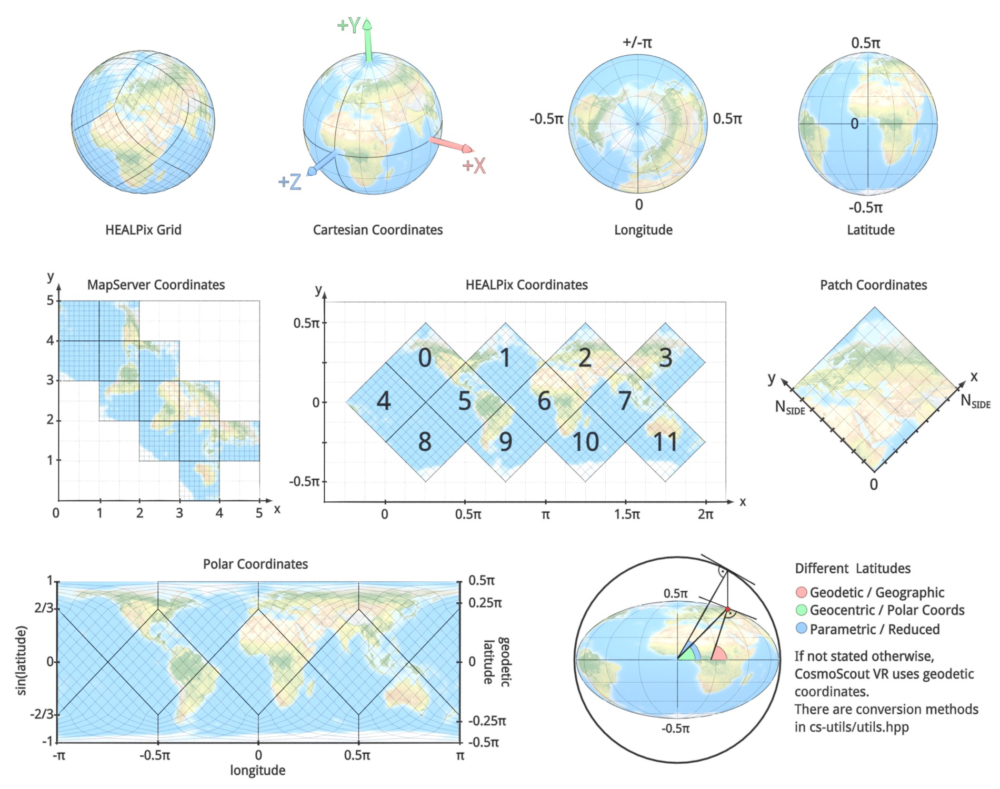

CosmoScout VR uses many different coordinate systems. This image summarizes some conventions.
The HEALPix and MapServer coordinate systems are specific to the [csp-lod-bodies](https://github.com/cosmoscout/csp-lod-bodies) plugin.

